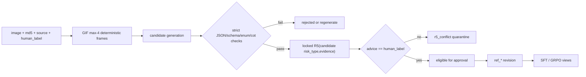

# 数据集制作方案与标注模型选型调研

> 调研日期：2026-08-06  
> 状态：数据与媒体方案已确认；API/本地标注模型职责保留到同一 pilot 后决定  
> 范围：约 1 万条图片/GIF，10 类 `human_label`，46 类 `risk_type`，SFT→GRPO，Qwen3-VL-8B actor，8×V100-SXM2-16GB  
> 不包含：最终验收门槛与独立盲测集设计

## 1. 执行结论

建议按现有数据结构组织三个处理阶段：

1. **基础输入**：直接使用现有图片、`md5`、来源和 `human_label`。
2. **标注结果**：关联同一 `md5` 保存 `candidate_*`、检查结果、`r5_conflict` 和获准的 `ref_*`。
3. **训练视图**：从获准记录导出 SFT、GRPO 和开发评估所需字段。

核心建议：

- 只使用现有 `md5` 识别完全重复媒体，同一 `md5` 不得跨数据分区；首版不增加近重复或来源分组。
- 静态图作为单个 image 输入，使用 Qwen3-VL 动态分辨率，视觉预算为1024 token（`max_pixels=1048576`）；不裁剪或改变宽高比。
- GIF 最多输入4帧：不超过4帧时全部使用，超过4帧时按累计播放时间均匀选取4帧并包含首尾帧；有序帧作为一个 video 帧列表输入，每帧视觉预算为256 token（`max_pixels=262144`），不得作为四张独立 image。数据制作、训练、评估和推理共用该规则。
- 数据集制作 prompt 与 actor prompt 分离；前者可见 `human_label` 和完整规则，后者不可见标签、`ref_*` 或 R5 信息。
- 数据状态使用追加式版本记录，不覆盖旧候选、旧参考或旧 R5 结果。
- 类别覆盖通过定向收集解决，不使用标签加权 sampler 或类别 reward 倍率。
- 图片和 GIF 已确认允许发送至外部 API，首版不需要按媒体出域等级拆分标注路线。
- API 候选使用项目既定 `qwen3.7-plus` 固定快照；本地同时评估 `Qwen3-VL-30B-A3B-Instruct` 与 `Qwen3-VL-32B-Instruct`。API 与本地模型的最终职责分工待实际 pilot 后决定。
- 正式选型前用同一批 200～500 条分层金标样本盲测字段质量、GIF 时序、格式、速度、显存和成本。

不存在脱离本项目媒体分布就能证明的“绝对最佳标注模型”。模型卡和通用榜单只用于筛选候选，最终决定必须来自项目 pilot。

## 2. 已确认的项目边界

- 原始数据包含图片/GIF、`md5` 标识、来源和 10 类 `human_label`，没有四个训练参考字段。
- 数据制作模型生成 `candidate_description/candidate_evidence/candidate_risk_type/candidate_cot`，候选不是训练真值。
- 只有获准的候选才能成为相应 `ref_*`。
- 参考 `risk_type/evidence` 经锁定版本 R5 后，`vlm_advice` 必须与 `human_label` 一致，才能进入主训练集。
- 真实字段与 R5 不一致的样本进入 `r5_conflict`；不得删除真实 evidence 强行命中。
- 多风险样本由 `human_label` 锚定唯一主风险域，evidence 仍保留跨域真实信号。
- evidence 使用集合语义；内部顺序不承载含义，首版不专门处理数组重复项。
- actor 输出固定为 `description → evidence → risk_type → cot`。
- 数据集制作 prompt 和 actor prompt 独立版本化；actor prompt 不包含标签、候选、参考、R5 或二元信息。
- 类别不平衡在收集阶段解决，训练使用常规随机采样。
- 人工检查的具体方式和覆盖率不写入本任务需求。

## 3. 数据资产分层

### 3.1 基础输入记录

直接沿用现有数据字段，不要求新增 SHA-256、采集时间、使用策略或独立的原始媒体 manifest：

```json
{
  "image": "path/or/object",
  "md5": "...",
  "source": "...",
  "human_label": "..."
}
```

`md5` 直接作为数据标识并关联后续候选、参考和训练记录，不再重复计算另一套媒体 ID。

### 3.2 图片与 GIF 输入处理（已确认）

静态图保留完整画面和宽高比，作为单个 image 输入；Qwen3-VL processor 在 `max_pixels=1048576` 上限内使用动态分辨率，超限时只做确定性等比例缩小。GIF 使用最多4帧的确定性规则，每帧上限为 `max_pixels=262144`，并把有序帧作为一个 video 对象/帧列表输入。该处理不扩展基础数据 schema；如需缓存抽帧结果，只保存最小处理信息：

```json
{
  "md5": "...",
  "media_pipeline_version": "gif_frames_v1",
  "frame_sampling_policy": "max_4_uniform_playback_time_include_first_last",
  "selected_frames": [
    {
      "frame_index": 0,
      "timestamp_ms": 0,
      "frame_uri": "..."
    }
  ]
}
```

Pillow 暴露 GIF 帧数、逐帧 `seek` 和帧持续时间；disposal/blend 会影响解码画面，因此应固定 Pillow 版本和项目解码实现，并对结果帧做回归测试。[Pillow GIF 文档](https://pillow.readthedocs.io/en/stable/handbook/image-file-formats.html#gif)

MS-SWIFT 支持图片、视频和视频帧列表；本项目可将确定性帧包映射为其 `videos`/帧列表输入。[MS-SWIFT Custom Dataset](https://github.com/modelscope/ms-swift/blob/main/docs/source_en/Customization/Custom-dataset.md)

具体规则：

- 原 GIF 帧数小于等于4时使用全部帧。
- 原 GIF 帧数大于4时，以累计播放时间的 `0、1/3、2/3、1` 位置选择对应帧，确保包含首帧和末帧。
- 四帧必须按播放顺序作为一个 video 帧列表输入；若错误地作为四张独立 image，会套用静态图预算并改变时序语义。
- 数据制作 API、本地标注模型、SFT、GRPO、评估和推理使用同一图片或同一抽帧结果、动态分辨率上限与 `media_pipeline_version`。
- 不允许教师看完整 GIF、actor 只看一帧，否则 reference 可能依赖 actor 永远看不到的证据。
- 抽帧改变时生成新的 `media_pipeline_version`，不覆盖旧帧包。

### 3.3 标注生命周期层 `annotation_revision`

一条记录对应一个不可变 revision：

```json
{
  "md5": "...",
  "annotation_revision": 3,
  "source": "...",
  "human_label": "...",

  "candidate_description": "...",
  "candidate_evidence": ["..."],
  "candidate_risk_type": "...",
  "candidate_cot": ["..."],

  "candidate_model_id": "...",
  "candidate_model_revision": "...",
  "dataset_prompt_version": "...",
  "taxonomy_schema_version": "...",
  "candidate_generation_config": {},
  "candidate_request_id": "...",
  "candidate_raw_response_uri": "...",

  "json_valid": true,
  "schema_valid": true,
  "enum_valid": true,
  "cot_consistent": true,
  "r5_version": "...",
  "candidate_r5_advice": "...",
  "candidate_r5_confidence": 0.0,
  "r5_matches_human_label": true,

  "status": "candidate|r5_conflict|ref_approved|rejected",
  "ref_description": "...",
  "ref_evidence": ["..."],
  "ref_risk_type": "...",
  "ref_cot": ["..."],
  "created_at": "..."
}
```

`candidate_r5_confidence` 可作为离线溯源字段保存，但不进入 actor prompt、assistant target 或 GRPO reward。

不建议覆盖 candidate 变成 ref。保留二者可以回答候选模型错在哪里、哪些字段被修改、taxonomy 或 R5 升级影响了哪些样本。

### 3.4 数据划分层 `split_assignment`

参考四字段完成后，按 `train:dev=90%:10%` 划分，约为9000/1000条；以 `md5` 为隔离单位，并尽量保持10类 `human_label` 与46类 `ref_risk_type` 的比例。随机种子固定并记录，SFT 与 GRPO 共用该划分。

```json
{
  "md5": "...",
  "split_policy_version": "...",
  "split": "train|dev",
  "assigned_at": "..."
}
```

dev 只用于训练诊断、checkpoint 选择和调参，不作为最终验收集。本文不决定最终验收集；历史 2214 样本继续作为回归集，不自动并入训练数据或最终盲测。

## 4. 媒体重复与分区隔离

本节“去重”是媒体资产去重，与 evidence 数组是否重复无关。

### 4.1 首版规则（已确认）

1. 直接使用现有 `md5` 识别完全重复媒体。
2. 同一 `md5` 的记录必须分配到同一 split，不得同时出现在 train 和 dev。
3. 首版不引入 pHash、视觉 embedding、模板近重复检测或按 `source` 分组。

本节的媒体重复与 evidence 数组重复无关。

### 4.2 按 `md5` 分配 split

```text
现有数据记录
  → 按 md5 识别完全重复
  → 以 md5 为单位分配 train/dev
  → 再派生 SFT/GRPO view
```

`source` 仅作为已有信息保留，不用于首版 split 分组。

## 5. 类别覆盖与数据收集

首版不使用类别加权 sampler，因此数据收集必须在训练前解决覆盖不足。

### 5.1 首版配额（已确认）

10,000条指完成参考确认并通过全部准入门禁的有效样本。首轮配额为：

| `human_label` | 数量 |
|---|---:|
| good | 6,500 |
| gamble | 750 |
| porn | 700 |
| finance | 470 |
| politic | 460 |
| other_fraud | 360 |
| login | 320 |
| fake | 260 |
| vpn | 90 |
| game | 90 |
| **合计** | **10,000** |

good 内部为 `good_clean=4,500`、`good_risk_signal=2,000`。其中 `good_risk_signal` 的采集方向已确认为：porn相似但合规450、finance相似但合规400、gamble/game相似但合规300、login/客服/二维码/线路相似300、fake/官方/品牌相似但合规300、politic/军警/新闻相似但合规150、跨域多弱信号但仍为good 100。该分层不改变最终标签；参考确认后实际构成非-good的样本必须移入对应配额。其余9类共3,500条；44个非-good `ref_risk_type` 每类至少60条，占用2,640条，剩余860条按历史错误、业务频率、严重性和边界复杂度定向补充。首版困难/边界硬配额仅固定2,000条 `good_risk_signal`；非-good困难正例不设500条总量或每类8条硬指标，采集中自然出现则保留和统计，训练诊断证明必要后再定向补充。

good/其余9类只是按 `human_label` 定义的采集桶，不预设46类 `risk_type` 到二元结果的固定映射；最终二元结果仍由R5决定。50/50不作为首版默认方案；它不等于10类或46类平衡，相对历史业务先验偏移过大，而且当前35%预算已经能够完成44类最低覆盖并留出860条定向补充。完整推导见 `数据规模与业务类别比例调研.md`。

采集和制作过程中持续输出以下交叉表，检查配额是否被低多样性样本占满：

- 10 类 `human_label`；
- 46 类 `ref_risk_type`；
- 静态图/GIF；
- 来源与页面模板；
- evidence 单项/多项/允许空集；
- 易例、边界例、历史误报、历史漏报；
- 文字主导、视觉主导、时序主导。

10k是首版启动规模，不是46类充分性的先验结论。最终使用固定final_dev的2.5k/5k/7.5k/10k嵌套学习曲线，判断停止收集或继续定向补类。

### 5.2 收集配额层次

1. 保证每个 `human_label` 有真实覆盖。
2. 保证各自内部 46 类 `risk_type` 和关键边界对。
3. 对高误报类补充相似但应为 good/弱风险的困难负样本。
4. 对高漏报类补充文字弱、画面弱、仅 GIF 某些帧出现证据的困难正样本。
5. 对多 evidence、跨风险域 evidence 和四个空 evidence `*_other` 单独设覆盖清单。

配额按独立 `md5` 数统计。

### 5.3 两轮收集（已确认）

1. 第一轮按10类 `human_label` 配额收集常规业务数据，不专项搜索非-good困难正例。
2. 完成候选四字段、参考确认和准入后，自动统计46类 `ref_risk_type` 与七个 `good_risk_signal` 混淆方向的实际覆盖。
3. 第二轮只补低于60条的risk_type和未完成的good混淆方向。
4. 第二轮缺口类别只用于数据管道外的素材选择；期望 `risk_type/evidence` 不进入数据集制作Prompt，避免候选模型被预期答案锚定。
5. 两轮使用相同的 `dataset_prompt_version`、`taxonomy_schema_version` 和媒体处理规则。
6. 达到10,000条门禁后有效样本并完成既定配额后停止；原始抓取量不写死。

### 5.4 公开数据混合（已确认）

- 首版 SFT 先以100%业务四字段数据建立基线，不直接混入公开原生 VQA、caption、通用聊天或纯文本指令数据。
- 首版 GRPO 不接收缺少完整 `risk_type/evidence/human_label/R5` reference 的公开原生样本。
- 单独准备200～500条不参与训练的生产相关能力保持集，诊断中文 OCR、UI/文档、细节识别、GIF时序和四字段 JSON 稳定性；该集合不是最终验收集。
- 只有确认 adapter 加载状态下的生产相关能力退化，才测试5%和10%的定向 replay。
- replay 公开素材必须重新制作为同 actor prompt、同 taxonomy、同四字段 schema 的项目兼容数据，并通过与业务数据相同的准入；比例同时按 assistant token 与 visual token 统计。

研究依据、候选来源、许可门禁和消融控制详见 `公开数据混合与能力退化调研.md`。

## 6. 数据集制作流程

### 6.1 双 prompt

#### 数据集制作 prompt

可见：

- 图片/GIF；
- `human_label`；
- 完整 taxonomy、详细边界规则；
- candidate 四字段规则；
- “不得删除真实 evidence 强行匹配 R5”的明确约束。

输出进入 `candidate_*`，不直接成为训练 target。

#### Actor prompt

可见：

- 图片/GIF；
- 紧凑 taxonomy：完整枚举、简短定义、risk_type-evidence 映射、空集规则；
- 四字段 JSON schema。

不可见：`human_label`、`candidate_*`、`ref_*`、R5、advice、confidence、二元标签和样本元数据。

SFT、GRPO、开发评估和部署共用同一个 `actor_prompt_version` 和 `taxonomy_schema_version`。

两套Prompt的完整正文、模板变量、结构化输出schema、自动修复Prompt、SFT assistant target、防泄漏扫描以及两轮收集中的调用规则，统一见[数据集制作与训练Prompt规范.md](数据集制作与训练Prompt规范.md)。本文件只维护流程和职责，不复制Prompt正文，避免形成多份漂移版本。

### 6.2 候选到参考的状态机



### 6.3 严格自动检查

- 单一 JSON object、无 Markdown 前后缀；
- 精确四字段和正确类型；
- key 顺序 `description/evidence/risk_type/cot`；
- risk_type/evidence 封闭枚举；
- 四个 `*_other` 以外 evidence 非空；
- cot 为 1～3 个非空字符串；
- cot 覆盖预测 evidence、不引入数组外 evidence、确认同一 risk_type，并先 evidence 后 risk_type；
- R5 版本固定、输出可重放；
- `r5_matches_human_label`。

按照已确认要求，首版不检查 evidence 数组排列或重复项。

### 6.4 追加式修订

以下变化必须创建新 revision：

- candidate 模型或生成参数改变；
- `dataset_prompt_version` 改变；
- taxonomy 变更；
- R5 版本改变；
- 任一 `ref_*` 改变；
- GIF 抽帧/媒体处理改变。

旧 revision 保留以支持 lineage 和 reward replay。

## 7. SFT 与 GRPO 数据视图

### 7.1 SFT view

```json
{
  "messages": [
    {"role": "system", "content": "actor prompt contract + compact taxonomy"},
    {"role": "user", "content": "media placeholder + fixed instruction"},
    {"role": "assistant", "content": "{canonical ref JSON}"}
  ],
  "images_or_videos": ["image"]
}
```

assistant target 只取四个 `ref_*` 的值并映射为生产键名；离线字段名和元数据不进入 token 序列。

### 7.2 GRPO view

actor 可见部分与 SFT 相同，但没有参考 assistant response。reward 侧隐藏列包括：

```text
ref_risk_type
ref_evidence
human_label
r5_version
md5
```

`ref_description/ref_cot` 可保留用于离线诊断，但首版不进入在线语义 reward。

### 7.3 开发评估 view

开发集占10%，与90%的 train 按 `md5` 隔离，并尽量维持 `human_label/ref_risk_type` 分布。评估使用相同 actor prompt，但使用独立确定性/低温生成参数，不使用 rollout 的 `temperature=0.9`。

## 8. 数据制作模型的共同准入要求

数据制作模型必须直接处理项目图片/GIF。若选纯文本 LLM，就需要先用 OCR/VLM 生成描述再分类，会增加不可见误差层，因此不作为首版主线。

所有候选路线必须满足：

- 中文图片文字和页面结构理解；
- 多图/帧序列或视频输入；
- 严格 JSON 输出；
- 46 类与 evidence 枚举遵循；
- 固定模型 revision、prompt 和生成参数；
- 保存原始响应、失败原因和 usage；
- 在相同图片/GIF输入和 pilot 上比较。

## 9. API 路线

### 9.1 主候选

项目已指定 `qwen3.7-plus`。截至调研日期，阿里云官方资料列出其图像/视频输入、结构化输出、长上下文及固定快照；正式数据制作建议记录精确 snapshot，而不是只保存滚动别名。[Qwen3.7-Plus 模型信息](https://www.alibabacloud.com/help/en/model-studio/qwen3-7-plus)、[视觉理解模型选型](https://www.alibabacloud.com/help/en/model-studio/vision-model)

首版建议配置：

```text
model = qwen3.7-plus-2026-05-26
enable_thinking = false
response_format = {"type": "json_object"}
temperature = 0 或服务支持的最低稳定值
```

选择 non-thinking JSON mode 是为了稳定生成项目定义的四字段 JSON；项目的 `cot` 仍是显式、简短的 evidence→risk_type 确认，不等于服务端长推理。JSON mode 不能代替项目的字段、枚举和 R5 校验。[阿里云结构化输出](https://www.alibabacloud.com/help/en/model-studio/qwen-structured-output)

### 9.2 优点

- 无需占用训练用 V100；
- 多模态和结构化输出由服务提供；
- 易于并发和失败重试；
- 作为比 8B actor 更强的候选教师，避免学生自标注的强相关错误。

### 9.3 风险

- 图片和 GIF 的外部 API 发送许可已确认；仍须用 `md5` 关联请求及其原始响应；
- 滚动模型别名可能更新，必须固定 snapshot；
- 图片/GIF token 和费用依赖分辨率、帧数及 prompt 长度；
- JSON mode 不保证 taxonomy 正确；
- API 限流、区域、文件上传和 URL 生命周期会影响批处理。

阿里云官方 FAQ 声明调用数据不用于模型训练，但项目仍应依据自身数据等级和区域政策决定是否允许上传，而不能只用供应商声明替代内部审批。[Model Studio FAQ](https://www.alibabacloud.com/help/en/model-studio/faq-about-alibaba-cloud-model-studio)

### 9.4 成本估算方法

不要在需求中写死一次性总价。先运行 200～500 条 pilot，从 API usage 记录真实输入/输出 token：

\[
C_{10k}=10000\times
\frac{\bar T_{in}P_{in}+\bar T_{out}P_{out}}{10^6}
\]

价格 `P` 必须在开跑前从对应区域官方计费页重新读取；固定快照、滚动别名和 Batch 能力可能不同。调研日期的价格不能替代采购报价。

每个请求至少保存：

```text
model snapshot
request_id
dataset_prompt_version
taxonomy_schema_version
md5
generation config
raw response
token usage
latency/error
```

## 10. 本地路线

### 10.1 为什么不直接用 actor 8B 做主教师

`Qwen3-VL-8B-Instruct` 可做管道 smoke test 或资源优先候选，但让同一 8B 家族产生 reference 并接受这些 reference 训练，会使错误高度相关，难以提供稳定能力增益，因此不建议作为唯一正式数据制作模型。

### 10.2 候选 A：Qwen3-VL-30B-A3B-Instruct

官方模型卡描述其为约 31B 总参数的 MoE 多模态模型，约 3B 参数按 token 激活，支持图像/视频与长上下文。[Qwen3-VL-30B-A3B-Instruct](https://huggingface.co/Qwen/Qwen3-VL-30B-A3B-Instruct)

FP16 仅权重理论下限约为：

\[
31\text{B}\times2\text{ bytes}\approx62\text{ GB}
\]

MoE 不会把常驻权重降到 3B，主要降低每 token 激活计算量。因此它是**潜在吞吐优先候选**，不是已经证明效果优于 32B dense 的模型。

### 10.3 候选 B：Qwen3-VL-32B-Instruct

官方模型卡描述其为约 33B 参数的 dense 多模态模型，支持图像、视频和多语言 OCR。[Qwen3-VL-32B-Instruct](https://huggingface.co/Qwen/Qwen3-VL-32B-Instruct)

FP16 仅权重理论下限约为：

\[
33\text{B}\times2\text{ bytes}\approx66\text{ GB}
\]

它是 dense 能力候选。是否在本项目 46 类和 GIF 上优于 30B-A3B，必须通过同一 pilot 判定，不能由 dense/MoE 名称推断。

### 10.4 8×V100 的现实边界

8×16GB 提供 128GB 聚合显存，因此 30B/32B FP16 权重在总量上可容纳；但还需 vision encoder、KV cache、CUDA workspace、输入张量和跨卡通信空间。

V100 不支持 BF16，应显式使用 FP16。FlashAttention 官方 CUDA 路径面向 Ampere/Ada/Hopper，不把 V100 作为支持目标，因此应从 SDPA 或 eager attention 开始。[FlashAttention 官方仓库](https://github.com/Dao-AILab/flash-attention)

当前 vLLM V1 已移除 V100 支持，而兼容 V100 的旧路径可能早于 Qwen3-VL 正式支持，不建议把“旧 vLLM + 新 Qwen3-VL”设为正式基线。[vLLM V100 支持 RFC](https://github.com/vllm-project/vllm/issues/18571)

首版本地 smoke test：

```text
Transformers + Accelerate
dtype = float16
attention = sdpa；不兼容时 eager
跨 8 GPU device map
batch_size = 1
使用同一图片/GIF输入
```

Accelerate Big Model Inference 支持把无法单卡容纳的模型分派到多 GPU，但 `device_map=auto` 可运行不代表吞吐满足 1 万条制作要求。[Accelerate Big Model Inference](https://huggingface.co/docs/accelerate/usage_guides/big_modeling)

### 10.5 本地路线优缺点

优点：

- 媒体不出本地；
- 模型、代码和权重可固定；
- 大批量重跑没有按 token API 费用。

风险：

- 占用同一套 V100，和 SFT/GRPO 排期冲突；
- 30B/32B Transformers 跨卡推理可能很慢；
- 没有 FlashAttention/vLLM 主流加速路径；
- JSON 服从性、中文 OCR 和 GIF 时序效果未知；
- 本地批处理、失败恢复和服务维护需要工程投入。

## 11. API、本地和混合方案比较

| 维度 | API `qwen3.7-plus` | 本地 30B-A3B/32B | 混合 |
|---|---|---|---|
| 首版启动成本 | 低 | 中高 | 中 |
| 媒体出域 | 是 | 否 | 按路由策略 |
| 复现 | 固定 snapshot 后较好 | 权重+代码全固定最好 | 较复杂 |
| V100 占用 | 无 | 高 | 部分 |
| JSON 支持 | 服务端 JSON mode + 项目校验 | 项目自行约束和校验 | 两套都校验 |
| 1万条吞吐 | pilot 后由限流估算 | pilot 后由实测估算 | 可并行 |
| 候选质量 | 未经项目实测 | 未经项目实测 | 可利用分歧 |
| 隐私 | 取决于出域许可 | 最强 | 可按数据等级 |

### 11.1 推荐路由

以下是条件化建议，不是已确认决策；本项目将在实际 pilot 后再确定 API 与本地模型的主生成、抽样对照和备用职责。

1. **允许出域（本项目已确认）**：API 固定 snapshot 作为主候选生成器，本地模型做分层抽样复核或故障备用。
2. **禁止出域**：对本地 30B-A3B 与 32B 做同一 pilot，选择质量达标且吞吐可接受者；两者均不达标时，不应降级为未验证的自动 reference。
3. **混合数据等级**：受限媒体只走本地；允许出域媒体走 API。两个路径使用同一 taxonomy、媒体帧包和自动校验。

## 12. 统一模型 pilot

### 12.1 样本设计

选择 200～500 条已经确认的分层样本，覆盖：

- 10 类 `human_label` 和尽可能多的 46 类 `risk_type`；
- 静态图、长图、GIF；
- 文字主导、视觉主导、时序主导；
- 单 evidence、多 evidence、跨域 evidence、允许空 evidence；
- 历史误报、历史漏报和相邻类别边界；
- 同类中的简单与困难样本。

pilot 样本不能从待比较模型生成的 candidate 反向构造，否则会偏向该模型。

### 12.2 比较指标

| 指标 | 说明 |
|---|---|
| strict JSON pass | 单 object、四键、字段类型 |
| risk_type exact | 对批准参考的 46 类 exact-match |
| evidence precision/recall/F1 | 集合语义 |
| R5→human_label match | 端到端一致，不能替代字段正确性 |
| cot mechanical score | coverage/no-extra/type/order |
| description factual error | 独立记录，不用 R5 代替 |
| GIF temporal accuracy | 证据是否位于模型实际可见帧 |
| candidate acceptance/change rate | 候选到 ref 的修改情况 |
| latency/throughput | 图片与 GIF 分开 |
| cost or GPU-hours | 按同一批样本计算 |
| failure/retry rate | API、本地分别记录 |
| peak VRAM | 本地候选必须实测 |

### 12.3 决策顺序

1. 数据允许出域已确认，API 保留为主候选路线。
2. 本地模型是否无 OOM、无 NaN、可重放。
3. 先比较字段质量，再比较 R5 outcome。
4. 质量接近时再比较吞吐、成本和维护复杂度。
5. 不把同系列模型的通用榜单差异当作项目金标结果。

本文不预设未经确认的绝对合格阈值。阈值应在 pilot 金标规模和候选分布确定后讨论。

## 13. 候选生成策略

### 13.1 首版建议

- 低温、非 thinking、严格 JSON；
- 每个媒体先生成 1 个候选；
- 只对 JSON失败、自动规则失败、R5冲突或模型分歧样本重试/升级；
- 重试保存新 revision，不覆盖原始响应；
- 不把“多次采样后挑一个 R5 命中结果”作为默认策略，否则会鼓励规则投机。

### 13.2 可选的双模型审查

若资源允许，可让 API 与本地模型在一小部分样本上独立生成候选。分歧用于发现困难样本，不直接用多数投票生成 reference，因为两个模型仍可能共享 taxonomy 或视觉错误。

## 14. 数据质量报告

每次数据版本冻结前至少输出：

- 输入记录数、独立 `md5` 数和完全重复数量；
- 图片/GIF 数及 GIF 帧数、时长、分辨率分布；
- 10 类、46 类、evidence 和边界切片覆盖；
- candidate JSON/schema/enum/cot 通过率；
- R5一致率和 `r5_conflict` 数；
- candidate→ref 各字段修改率；
- 各候选模型、prompt/taxonomy/R5版本的样本数；
- train/dev 的90%/10%规模、类别分布和 `md5` 隔离检查；
- actor tokenizer 下 prompt、视觉和 completion token 分布；
- 缺文件、坏图、坏 GIF、空帧、超长样本和处理失败数。

## 15. 数据版本冻结清单

一个可训练数据版本至少固定：

```text
dataset_version
dataset_manifest_hash
media_pipeline_version
split_policy_version
dataset_prompt_version
actor_prompt_version
taxonomy_schema_version
r5_version
candidate_model_revisions
candidate_generation_configs
SFT_GRPO_view_generator_commit
tokenizer_processor_revision
```

训练配置只引用冻结的数据版本，不直接读取“最新”标注表或滚动模型别名。

## 16. 实施伪代码

```python
split_by_md5_stratified(
    dataset_rows,
    train_ratio=0.90,
    strata=["human_label", "ref_risk_type"],
    seed=split_seed,
)

for sample in annotation_queue:
    model_input = prepare_media(sample.image, media_pipeline_version)
    candidate = generate_candidate(
        model=candidate_model_revision,
        prompt=render_dataset_prompt(
            dataset_prompt_version,
            taxonomy_schema_version,
            sample.human_label,
        ),
        media=model_input,
        generation_config=candidate_generation_config,
    )
    revision = append_candidate_and_raw_response(sample, candidate)

    parsed = strict_candidate_check(revision)
    if not parsed.ok:
        mark(revision, "rejected")
        continue

    r5_result = locked_r5(parsed.risk_type, parsed.evidence, r5_version)
    if r5_result.advice != sample.human_label:
        mark(revision, "r5_conflict")
        continue

    mark(revision, "eligible_for_approval")

approved = load_ref_approved_revisions()
export_sft_view(approved, actor_prompt_version, taxonomy_schema_version)
export_grpo_view(approved, actor_prompt_version, taxonomy_schema_version)
```

## 17. 风险与对抗性检查

| 风险 | 后果 | 防线 |
|---|---|---|
| 教师看到 human_label 后事后合理化 | 视觉事实错误但字段自洽 | candidate 不等于 ref；字段级检查；保留原始响应 |
| 为通过 R5 隐藏 evidence | 规则命中但语义失真 | evidence 完整性独立检查；冲突隔离 |
| 数据制作 prompt 被用于 actor | 标签泄漏和线上漂移 | prompt 分库、独立版本、token 泄漏扫描 |
| 教师看完整 GIF、actor看少量帧 | 不可学习 reference | 两者使用相同图片或相同 GIF 帧列表 |
| 相同 `md5` 跨 train/dev | 指标虚高 | 以 `md5` 为单位分配 split |
| 滚动 API 别名更新 | 数据批次不一致 | 固定 snapshot 和 request metadata |
| taxonomy/R5升级覆盖旧标签 | 无法复现 | append-only revision、版本冻结 |
| 只看 R5一致率选教师 | 鼓励字段投机 | risk exact、evidence F1、视觉事实并列 |
| 本地权重能装下就视为可部署 | OOM或低吞吐 | 真实 GIF pilot、显存和吞吐门槛 |
| 用完全重复素材补稀有类 | 表面平衡、有效多样性低 | 按独立 `md5` 计数 |

## 18. 推荐方案

### 18.1 数据方案

```text
image + md5 + source + human_label
→ GIF max-4 deterministic frames
→ md5 exact-duplicate grouping
→ md5-isolated train/dev assignment
→ versioned candidate revisions
→ strict field checks
→ locked R5 consistency
→ r5_conflict quarantine or ref approval
→ derived SFT/GRPO views
```

### 18.2 标注模型方案

- **API首选候选**：项目既定 `qwen3.7-plus` 固定 snapshot、non-thinking JSON mode；本项目的媒体出域条件已满足。
- **本地候选**：`Qwen3-VL-30B-A3B-Instruct` 与 `Qwen3-VL-32B-Instruct` 同时进入 pilot；前者偏潜在吞吐，后者为 dense 候选，不预判项目效果排名。
- **资源 smoke 候选**：Qwen3-VL-8B 可验证本地管道，但不作为唯一正式教师。
- **最终选择**：只依据同一 200～500 条分层金标 pilot。

“API 主生成、本地分层对照和离线备用”是当前资源条件下的建议方案，但项目暂不确认该职责划分。最终方案须根据 API 与本地 30B/32B 在同一 pilot 上的字段质量、GIF 时序表现、吞吐、显存和成本实测决定。若后续外部条件改变为禁止出域，则本地 30B/32B pilot 成为强制前置条件。

## 19. 已确认项与实验后事项

1. 基础输入采用图片、`md5`、来源和 `human_label`；媒体允许发送至外部 API；已确认；
2. 静态图1024视觉token、GIF最多4帧且256视觉token/帧；GIF按累计播放时间均匀抽帧并包含首尾帧，以单个video帧列表输入，所有阶段共用；已确认；
3. 只按 `md5` 识别完全重复，同一 `md5` 不跨 split，不做近重复或来源分组；已确认；
4. 参考标注后按 train/dev=90%/10%划分，保持 `md5` 隔离并尽量维持10类/46类比例，固定随机种子；已确认；
5. 首版不混公开原生训练数据；先做200～500条能力保持诊断，退化后再测试5%/10%同协议 replay；已确认；
6. 10类、46类和困难样本的数据收集配额：65/35、每个非-good risk_type至少60条、固定2,000条 good_risk_signal；非-good困难正例不设硬配额；已确认；
7. 数据 record schema 与 append-only revision；已确认；
8. 数据集制作与Actor Prompt正文、输出schema和重试策略已写入[数据集制作与训练Prompt规范.md](数据集制作与训练Prompt规范.md)；正式运行前仍需把taxonomy转换为结构化封闭枚举并冻结版本；
9. 200～500 条模型 pilot 的构成和选型门槛由实际数据准备；
10. 固定 API snapshot 及请求追踪字段；媒体出域许可已确认；
11. 本地 30B-A3B/32B 的 V100 smoke test；独立推理可同时比较 Transformers 手动均衡与 LMDeploy PyTorchEngine；
12. 根据实际 pilot 最终选择 API、本地或混合路线，并确定各自职责；此项有意保留到实验后决定；
13. SFT/GRPO view 的导出格式和版本冻结由实现侧完成。

## 20. 主要一手来源

- [Qwen3-VL-30B-A3B-Instruct 官方模型卡](https://huggingface.co/Qwen/Qwen3-VL-30B-A3B-Instruct)
- [Qwen3-VL-32B-Instruct 官方模型卡](https://huggingface.co/Qwen/Qwen3-VL-32B-Instruct)
- [Qwen3-VL-8B-Instruct 官方模型卡](https://huggingface.co/Qwen/Qwen3-VL-8B-Instruct)
- [阿里云 Qwen3.7-Plus 模型信息](https://www.alibabacloud.com/help/en/model-studio/qwen3-7-plus)
- [阿里云视觉理解模型](https://www.alibabacloud.com/help/en/model-studio/vision-model)
- [阿里云结构化输出](https://www.alibabacloud.com/help/en/model-studio/qwen-structured-output)
- [阿里云 Model Studio FAQ](https://www.alibabacloud.com/help/en/model-studio/faq-about-alibaba-cloud-model-studio)
- [MS-SWIFT Custom Dataset](https://github.com/modelscope/ms-swift/blob/main/docs/source_en/Customization/Custom-dataset.md)
- [Hugging Face Accelerate Big Model Inference](https://huggingface.co/docs/accelerate/usage_guides/big_modeling)
- [FlashAttention 官方仓库](https://github.com/Dao-AILab/flash-attention)
- [vLLM V100 支持 RFC](https://github.com/vllm-project/vllm/issues/18571)
- [Pillow GIF 格式文档](https://pillow.readthedocs.io/en/stable/handbook/image-file-formats.html#gif)
