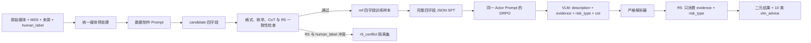

# Qwen3-VL 内容审核微调规格与验收文档

- 文档状态：已确认基线规格
- 目标模型：`Qwen3-VL-8B-Instruct`
- 训练阶段：SFT 后继续 GRPO
- 目标硬件：单机 8×NVIDIA Tesla V100-SXM2-16GB
- 最终业务结果：R5 产生的二元判定与 10 类 `vlm_advice`
- 规格原则：本文件定义可交付行为与可判定验收条件；尚未确认的精度阈值不得被实现方自行补造

## Problem Statement

项目需要使用视觉语言模型审核静态图片与 GIF，在保持现有 R5 决策规则权威性的前提下，提高模型对业务风险小类、可见证据和边界场景的识别能力。当前基础模型可以完成通用视觉理解，但在赌博、金融、仿冒、其他欺诈等细分类别上存在误报、漏报和中间标签不稳定问题。

VLM 与业务最终标签的粒度不同：VLM 需要输出 46 类 `risk_type` 以及封闭枚举的 `evidence`，R5 再根据这两个字段产生二元结果、10 类 `vlm_advice` 与内部置信度。VLM 不得直接学习或重定义 46 类到二元结果、10 类结果的固定映射，否则会形成与 R5 并存且可能冲突的第二套业务真值。

项目同时受以下约束：

1. 训练资源固定为单机 8×V100 16GB，V100 不原生支持 BF16，视觉 token 又可能造成显存峰值。
2. 原始业务数据只有媒体、MD5、来源和 10 类 `human_label`，缺少可直接用于 SFT/GRPO 的四字段参考答案。
3. SFT、GRPO、评估和部署必须采用同一 actor 输入输出契约，避免训练—推理分布漂移。
4. 数据制作提示词可以使用标签和完整规则，但 actor 不能看到标签、参考答案、R5 结果或 R5 内部规则。
5. 当前阶段尚未定义冻结盲测集及 precision、recall、F1 等数值门槛；历史指标只用于回归观察。

因此，本项目的交付重点是建立一条可复现、无标签泄漏、不会静默截断、能在目标硬件上稳定运行的训练与推理链路，并稳定产出可被 R5 消费的中间结果以及最终二元和 10 类业务结果。

## Solution

项目采用“数据制作—完整 JSON SFT—同契约 GRPO—R5 决策”的单向链路：

VLM 的正式输出是字段顺序固定的单个 JSON object：`description`、`evidence`、`risk_type`、`cot`。`description` 只描述可见事实；`evidence` 为封闭枚举数组；`risk_type` 为 46 类封闭枚举中的单值；`cot` 为 1～3 个短步骤组成的字符串数组，用于显式确认“可见事实如何支持每项 evidence，以及这些 evidence 如何支持最终 risk_type”。项目定义的 `cot` 是可检查的短确认，不是模型原生长思维链。

R5 只消费 `risk_type` 和 `evidence`。R5 是二元判定和 10 类业务分类的唯一真值来源；VLM 输出中的 `description` 和 `cot` 不进入 R5 决策。`vlm_confidence` 可作为 R5 内部输出保留，但不是当前对外验收所要求的最终结果。

数据集首版目标为 10,000 条通过检查的业务样本，按 MD5 隔离后固定为 90% train、10% dev。数据收集阶段主动塑造类别与边界样本分布，不在训练时使用类别加权 sampler 或类别 reward 倍率。首版不混入公开原始训练数据；另建 200～500 条不参与训练的能力保持集，用于观察 OCR、UI、文档、细节识别、GIF 时序和 JSON 稳定性是否退化。

训练以 FP16 LoRA 为主，冻结视觉编码器、多模态 merger/projector、token embedding 和 `lm_head`，只对语言解码器指定线性层注入 LoRA。SFT 监督完整生产 JSON；GRPO 从 SFT adapter 继续训练，并使用渐进格式分、严格语义门和分解奖励。8 张 V100 全部作为 ZeRO-3 训练 rank，GRPO 由同一组 rank 原地执行 Transformers rollout。

## User Stories

1. As an 内容审核调用方, I want 提交一张静态图片, so that 获得由 R5 决定的二元结果与 10 类业务分类。
2. As an 内容审核调用方, I want 提交一个 GIF, so that 模型能够基于时序画面而不是单一首帧进行判断。
3. As an 内容审核调用方, I want 所有成功响应都包含最终二元判定和 `vlm_advice`, so that 下游不必理解 46 类中间标签。
4. As an 内容审核调用方, I want 最终分类始终来自 R5, so that 线上只有一个业务真值来源。
5. As an R5 维护者, I want VLM 只向 R5 传入 `risk_type` 和 `evidence`, so that 规则不受自由文本干扰。
6. As an R5 维护者, I want VLM 不内置 46 类到二元结果的映射, so that R5 规则升级时无须重新定义模型契约。
7. As an 模型使用者, I want VLM 输出严格的四字段 JSON, so that 结果可以被确定性解析。
8. As an 模型使用者, I want JSON 字段顺序保持固定, so that SFT、奖励函数和部署解析器使用同一契约。
9. As an 模型使用者, I want 输出中没有 Markdown、`<think>` 或 JSON 外文本, so that 解析不会依赖模糊容错。
10. As an 审核分析人员, I want `description` 只陈述画面可见事实, so that 说明不会混入无法验证的推断。
11. As an 审核分析人员, I want `evidence` 只能取自封闭枚举, so that 每条证据都可以进入确定性规则检查。
12. As an 审核分析人员, I want `risk_type` 只能取自 46 类封闭枚举, so that 模型不会创造新的业务小类。
13. As an 审核分析人员, I want `cot` 显式核对 evidence 与 risk_type, so that 中间结论具有可机械检查的短证据链。
14. As an 审核分析人员, I want `cot` 限制为 1～3 个短步骤, so that 输出保持简洁并减少无关生成。
15. As an 数据所有者, I want 原始样本只要求媒体、MD5、来源和 `human_label`, so that 数据收集不依赖预先存在的模型中间标签。
16. As an 数据所有者, I want 数据制作先产生 `candidate_*` 而不是直接写入 `ref_*`, so that 自动生成内容不会未经确认进入主训练集。
17. As an 数据所有者, I want 候选答案经过格式、枚举、CoT 和 R5 检查, so that 正式参考答案满足完整契约。
18. As an 数据所有者, I want R5 结果与 `human_label` 冲突的样本进入 `r5_conflict`, so that 模型不会通过篡改证据学习规则缺陷。
19. As an 数据所有者, I want 同一 MD5 的媒体只存在于一个数据切分, so that dev 结果不受精确重复泄漏影响。
20. As an 数据所有者, I want 记录媒体来源, so that 后续可以追踪数据谱系和问题批次。
21. As an 数据所有者, I want 记录三类 Prompt/Schema 版本, so that 每个参考答案和模型结果都可追溯到生成契约。
22. As an 数据收集人员, I want 首版收集 10,000 条有效业务样本, so that SFT 与 GRPO 有可用的领域覆盖基础。
23. As an 数据收集人员, I want `good` 占多数但不是 50/50 平衡, so that 训练分布接近业务且仍覆盖足够风险样本。
24. As an 数据收集人员, I want `good_risk_signal` 被定向收集, so that 模型学习不把单一弱信号直接当成违规。
25. As an 数据收集人员, I want 44 个非 good 小类各至少覆盖 60 条, so that 长尾小类不会完全缺席。
26. As an 数据收集人员, I want 首版不依赖难以获得的公开数据改写, so that 项目可以先建立纯业务基线。
27. As an 数据工程师, I want 静态图片保留完整画面与宽高比, so that 缩放不会改变审核语义。
28. As an 数据工程师, I want 静态图片视觉 token 有固定上限, so that 极端分辨率不会造成不可控 OOM。
29. As an 数据工程师, I want 长 GIF 按累计播放时间均匀选取 4 帧, so that 变长帧时长不会扭曲采样位置。
30. As an 数据工程师, I want 不超过 4 帧的 GIF 使用全部原帧, so that 系统不会人为补帧或丢帧。
31. As an 数据工程师, I want GIF 的有序帧作为一个 video 输入, so that 模型能够保留帧序而不是处理成四张无关图片。
32. As an 数据工程师, I want 数据制作与训练共享同一媒体管线, so that 参考答案看到的视觉内容与 actor 一致。
33. As an 标注模型操作者, I want 数据制作 Prompt 可以读取 `human_label` 和完整规则, so that 候选答案能遵循业务边界。
34. As an 标注模型操作者, I want 在小规模试点后选择 API 或本地候选生成方式, so that 最终方案基于质量、吞吐与资源实测。
35. As an 训练工程师, I want actor Prompt 与数据制作 Prompt 独立版本化, so that 标签信息不会泄漏到模型输入。
36. As an 训练工程师, I want SFT、GRPO、评估和部署共享一个 canonical actor Prompt, so that 各阶段输出协议不漂移。
37. As an 训练工程师, I want 每个媒体只构成一个 actor Prompt 实例, so that 多 completion 表示同题采样而不是多套问法。
38. As an 训练工程师, I want SFT 对完整四字段 JSON 计算 assistant-only loss, so that actor 在进入 RL 前已经掌握生产输出协议。
39. As an 训练工程师, I want system、user 和视觉 token 不计入 SFT loss, so that 优化目标只覆盖模型答案。
40. As an 训练工程师, I want FP16 LoRA 在 8×V100 上作为主方案, so that 在能力与显存之间保持已确认取舍。
41. As an 训练工程师, I want 视觉塔和非目标模块全程冻结, so that 降低显存并避免小数据集破坏基础视觉表征。
42. As an 训练工程师, I want SFT 和 GRPO 延续同一 LoRA adapter, so that RL 从已经掌握四字段协议的策略开始。
43. As an GRPO 奖励维护者, I want 格式奖励逐级给分, so that 近似合法的输出也能获得修正方向。
44. As an GRPO 奖励维护者, I want 只有通过严格语义门的 completion 才计算语义奖励, so that 非法枚举或空证据不能利用下游奖励。
45. As an GRPO 奖励维护者, I want `risk_type` 使用 exact-match, so that 同一大类中的错误小类不会获得部分分。
46. As an GRPO 奖励维护者, I want `evidence` 使用集合 F1, so that 数组顺序和偶发重复不会改变语义得分。
47. As an GRPO 奖励维护者, I want R5 奖励只比较 `vlm_advice` 与 `human_label`, so that 奖励不依赖置信度、二元结果或内部路径。
48. As an GRPO 奖励维护者, I want `cot` 奖励只检查核心字段自洽性, so that 奖励函数不伪装成开放式推理评审器。
49. As an GRPO 奖励维护者, I want 不设置重复惩罚, so that 不与长度控制重复优化且不误罚合法枚举复述。
50. As an GRPO 奖励维护者, I want R5 基础设施错误中止或跳过批次并报警, so that 外部故障不会被记成模型零分。
51. As an 分布式训练操作者, I want 8 张 V100 都作为 ZeRO-3 训练 rank, so that 权重、梯度和优化器状态共同分片。
52. As an 分布式训练操作者, I want GRPO 原地使用 Transformers rollout, so that 首版不依赖 V100 不适配的稳定版 vLLM。
53. As an 分布式训练操作者, I want SFT 和 GRPO 每卡 micro-batch 都为 1, so that 视觉 token 峰值受控。
54. As an 分布式训练操作者, I want 按真实视觉 token 长度进行 `group_by_length`, so that 同批样本的填充浪费减少。
55. As an 分布式训练操作者, I want 超长样本被明确删除而非静默截断, so that taxonomy、视觉信息和 JSON 都不会被截成错误语义。
56. As an 分布式训练操作者, I want 纯 GPU ZeRO-3 作为默认方案, so that CPU/NVMe 数据搬运不会提前成为主要瓶颈。
57. As an 评估人员, I want 能力保持集不参与训练, so that 可以观察微调是否造成通用视觉能力退化。
58. As an 评估人员, I want 2.5k、5k、7.5k、10k 形成学习曲线, so that 10k 数据是否足够由实测决定。
59. As an 评估人员, I want 历史 2,214 条样本只作为回归参考, so that 它不会被误称为最终独立盲测集。
60. As an 部署工程师, I want 独立推理后端通过两卡实测选择, so that 最终部署兼顾 V100 兼容性、吞吐与显存。
61. As an 部署工程师, I want 生产使用与训练相同的 processor、媒体策略、actor Prompt 和 taxonomy 版本, so that 线上输入语义与训练一致。
62. As an 运维人员, I want 每次训练记录配置、版本、随机种子和环境, so that 结果能够复现和回滚。
63. As an 运维人员, I want 训练过程中监控 OOM、NaN/Inf、NCCL 状态和各 GPU 显存, so that 硬件与数值故障可以及时定位。
64. As an 项目负责人, I want 普通训练超参数可以根据 smoke test 与 dev 曲线调整, so that 规格约束业务契约而不是冻结未经实测的细节。

## Implementation Decisions

### 1. 端到端责任边界

1. VLM 负责输出 `description`、`evidence`、`risk_type`、`cot`，不直接输出或学习最终二元判定与 10 类业务分类。
2. R5 只消费 `risk_type` 和 `evidence`，产生唯一的 10 类 `vlm_advice`、内部 `vlm_confidence` 和最终二元判定。
3. 当前对外交付要求只包含最终二元结果与 10 类分类；不新定义二元字段名，沿用既有 R5/业务包装契约。
4. `description` 和 `cot` 用于监督、诊断和可解释性检查，不参与 R5 决策。

### 2. VLM 输出契约

1. completion 必须且只能是一个严格 JSON object，JSON 前后不得有其他文本。
2. canonical 字段顺序固定为 `description`、`evidence`、`risk_type`、`cot`；不得缺少或增加字段。
3. `description` 是非空字符串，只陈述可观察内容，不写最终业务分类，不虚构图外事实。
4. `evidence` 是字符串数组，只允许 taxonomy 定义的 evidence 值；数组顺序不承载语义，首版不要求去重，也不设置相关奖励、预处理或专项监控。
5. `risk_type` 是单个字符串，只允许 46 类枚举值。
6. 仅 `gamble_other`、`porn_other`、`politic_other`、`fraud_other` 允许 `evidence=[]`；其余 42 类至少包含一项合法 evidence。
7. `cot` 是包含 1～3 个非空短字符串的数组。它先确认画面事实对每一项 evidence 的支持，再确认 evidence 对 `risk_type` 的支持。
8. `cot` 不得声称存在 `evidence` 数组之外的证据；当 `evidence=[]` 时，必须说明风险域依据和退回相应 `*_other` 的原因。
9. 关闭 Qwen 原生 thinking；不得输出 `<think>`、Markdown 代码围栏或自由推理文本。
10. 46 类枚举由 10 个业务域组成：gamble 8 类、porn 7 类、politic 7 类、fake 4 类、other_fraud 5 类、finance 6 类、vpn 1 类、game 1 类、login 5 类、good 2 类。枚举具体值及 evidence 对应关系以锁定版本 taxonomy 为准。

### 3. 原始数据、参考答案与隔离规则

1. 原始记录的必要信息是媒体、MD5、来源和 10 类 `human_label`。
2. 数据制作阶段生成 `candidate_description`、`candidate_evidence`、`candidate_risk_type`、`candidate_cot`。
3. 候选结果必须通过 JSON、字段、类型、枚举、空 evidence、CoT 和 R5 一致性检查，并通过既定数据晋升流程后才成为 `ref_*`。
4. 将参考 `risk_type/evidence` 输入锁定版本 R5 后，只有 `vlm_advice == human_label` 的样本可以进入 SFT/GRPO 主训练集。
5. 未解决的不一致样本必须进入 `r5_conflict` 隔离集；不得删减真实 evidence 或改造参考答案来强行命中 R5。
6. 多风险样本由 `human_label` 锚定唯一主业务域；`risk_type` 从该域中选择，但 `evidence` 仍保留所有真实可见信号。
7. MD5 仅用于精确重复检查和切分隔离。首版不引入 pHash、embedding 或来源级聚类去重。

### 4. 数据规模与分布

1. 首版主数据集包含 10,000 条通过全部检查的有效业务样本。
2. 按固定随机种子切分为 9,000 条 train 和 1,000 条 dev；相同 MD5 不得跨切分。
3. SFT 与 GRPO 使用同一 train/dev 划分。
4. 10 类目标数量为：good 6,500、gamble 750、porn 700、finance 470、politic 460、other_fraud 360、login 320、fake 260、vpn 90、game 90。
5. good 内部为 `good_clean` 4,500 条、`good_risk_signal` 2,000 条。
6. 44 个非 good `risk_type` 各至少收集 60 条，剩余 860 条按错误风险和业务优先级定向补充。
7. `good_risk_signal` 的定向构成为：色情相似信号 450、金融相似信号 400、赌博/游戏相似信号 300、登录/客服/二维码/线路相似信号 300、仿冒/官方/品牌相似信号 300、政治/军事/新闻相似信号 150、跨域弱信号 100。
8. 不采用 50/50 good/risk：该比例会显著偏离真实业务中 good 占多数的先验，放大风险预测倾向并增加误报；同时风险侧按 9 个大类和 44 个小类展开，35% 的风险样本已经承担更高的信息密度。
9. 类别不平衡通过数据收集解决；训练阶段保持常规随机打乱，不使用按 `human_label` 或 `risk_type` 加权的 sampler，也不使用类别 reward 倍率。
10. 首版 SFT/GRPO 不混入公开原始训练数据。另建 200～500 条不参与训练的能力保持集；只有确认实质退化后，才把许可合格的公开素材按同一生产契约改写，并试验 5% 或 10% 定向 replay。
11. 分别在 2.5k、5k、7.5k、10k 子集上形成学习曲线，用实测判断 10k 是否进入收益平台期；本规格不预先断言 10k 已足够覆盖所有质量目标。

### 5. Prompt 体系

1. 数据制作 Prompt 与 actor Prompt 是两套独立正文和独立版本。
2. 数据制作 Prompt 可以读取媒体、`human_label`、完整 taxonomy、详细边界和候选生成规则，用于生成 `candidate_*`。
3. 数据制作 API 候选模型为 `qwen3.7-plus`；本地候选模型在试点后决定。
4. actor Prompt 只包含任务说明、紧凑但完整的 taxonomy（完整 risk_type/evidence 枚举、每类简短定义、risk_type 与 evidence 的映射关系、空集合规则）、四字段 JSON schema。
5. actor Prompt 严禁出现 `human_label`、`candidate_*`、`ref_*`、R5 结果、R5 内部规则、10 类答案或二元标签。
6. SFT、GRPO、dev 评估和部署共享一个 canonical actor Prompt；每个媒体对应一个单轮实例，不维护多套问题模板。
7. 必须记录 `dataset_prompt_version`、`actor_prompt_version` 和 `taxonomy_schema_version`。

### 6. 统一媒体处理

1. 静态图片作为单个 image 输入，使用 Qwen3-VL 动态分辨率，`IMAGE_MAX_TOKEN_NUM=1024`，等价上限 `max_pixels=1,048,576`。
2. 静态图片保留宽高比和完整画面；超限时只做确定性等比例缩小，不裁剪、不拉伸。
3. GIF 原始帧数不超过 4 时使用全部帧，不补帧。
4. GIF 原始帧数超过 4 时，按累计播放时间的 0、1/3、2/3、1 位置确定性选择 4 帧。
5. GIF 有序帧必须作为一个 video 帧列表输入，不得表示为四张独立 image。
6. GIF 每帧 `VIDEO_MAX_TOKEN_NUM=256`，等价上限 `max_pixels=262,144`。
7. 数据制作、SFT、GRPO、评估和部署共享同一媒体实现及版本。

### 7. SFT 训练

1. 使用 `Qwen3-VL-8B-Instruct`，4B 只保留为资源优先备选，不进入首版正式 actor。
2. 使用 MS-SWIFT 标准 Transformers 后端与 DeepSpeed ZeRO-3；原生 Hugging Face 组合只在 MS-SWIFT 出现不可绕过阻断时作为单一替代实现，不并行维护两套主链路。
3. 主方案为 FP16 LoRA，底座不量化。QLoRA 只在完成显存收缩后仍 OOM 时作为备选；全参数微调不进入首版实验矩阵。
4. 冻结视觉编码器、multimodal merger/projector、token embedding 和 `lm_head`。
5. LoRA 只注入语言解码器的 `q_proj`、`k_proj`、`v_proj`、`o_proj`、`gate_proj`、`up_proj`、`down_proj`。
6. 使用 `lora_rank=32`、`lora_alpha=64`、`lora_bias=none`、`lora_dropout=0.05`。
7. SFT target 是完整四字段生产 JSON，采用 assistant-only token loss；system、user 与视觉 token 不进入 loss。
8. `per_device_train_batch_size=1`、`gradient_accumulation_steps=2`，8 卡有效 batch 为 16。
9. 开启按真实 processor 长度计算的 `group_by_length`；SFT 使用包含目标 JSON 的 target-inclusive length cache。
10. 禁止 packing、padding-free 和 FlashAttention-2；attention 首选 SDPA，不兼容时回退 eager。
11. 普通学习率、epoch、scheduler、warmup、保存频率和早停策略由实现方依据 smoke test、显存与 dev 曲线决定，并记录为可复现实验配置。

### 8. GRPO 训练与采样

1. GRPO 从正式 SFT adapter 加载，继续生成相同四字段 JSON。
2. GRPO 有效 dropout 为 0，显式设置 `disable_dropout=true`。
3. 使用 SFT 初始策略的冻结快照作为 reference；`beta=0.04`、`kl_in_reward=false`、`scale_rewards=batch`、`dynamic_sample=false`。
4. `per_device_train_batch_size=1`、`gradient_accumulation_steps=1`、`generation_batch_size=8`。
5. 首轮 `num_generations=4`，即每个 generation batch 为 2 个 Prompt 实例 × 每实例 4 个 completion。只有 smoke test 不稳定时才降为 2；降级后同一批次为 4 个 Prompt 实例 × 每实例 2 个 completion，总 completion 数仍为 8。
6. rollout 使用 `do_sample=true`、`temperature=0.9`、`top_p=0.95`、`top_k=-1`、`num_beams=1`、`repetition_penalty=1.0`。
7. dev 评估使用相同 actor Prompt，但采用独立的确定性低温生成配置，不复用训练采样温度。
8. 首轮 `max_completion_length=512`；正式软长度边界由合法参考 completion 的 P95 确定，硬上限至少覆盖 P99 并留余量。
9. 开启按真实 processor 长度计算的 `group_by_length`；GRPO 使用 prompt-only length cache。
10. 所有阶段采用删除式超长策略，不允许静默截断 taxonomy、视觉 token 或输出 JSON。

### 9. GRPO 奖励

设 `J` 表示可解析为严格 JSON object，`K` 表示恰好包含四个要求字段，`T` 表示字段类型与非空要求正确，`E` 表示枚举及 evidence 空集合规则正确，`C` 表示 canonical 字段顺序正确。各变量取 0 或 1。

1. 渐进格式分为 `r_fmt = 0.25J + 0.20JK + 0.20JKT + 0.25JKTE + 0.10JKTEC`。
2. 严格语义门为 `g = JKTE`。只有 `g=1` 才计算 `risk_type`、`evidence`、R5 outcome 和 `cot` 奖励并调用 R5；字段顺序错误只损失格式分，不关闭语义门。
3. 单条 completion 总奖励为 `R = 0.20×r_fmt + g×(0.25×r_type + 0.35×r_ev + 0.15×r_R5 + 0.05×r_cot) + p_len`，其中 `p_len` 是下述软超长惩罚。
4. 正向奖励总权重为 format/type/evidence/R5/cot = `0.20/0.25/0.35/0.15/0.05`。
5. `r_type` 是预测 `risk_type` 与参考 `risk_type` 的 46 类 exact-match。
6. `r_ev` 先将预测与参考 evidence 转为集合：两边都空取 1，仅一边为空取 0，否则取 `2×|交集|/(|预测集|+|参考集|)`。
7. `r_R5` 仅比较预测字段经锁定 R5 得到的 `vlm_advice` 是否等于 `human_label`。不使用 `vlm_confidence`、二元结果或 R5 内部路径。
8. `r_cot = 0.40×coverage + 0.20×no_extra + 0.20×type_mention + 0.20×order_ok`。四项均取 0 或 1：`coverage=1` 要求预测 evidence 中每一项都被 CoT 显式确认，空 evidence 时要求先显式确认 `evidence=[]`；`no_extra=1` 要求 CoT 不声称存在预测数组之外的 evidence；`type_mention=1` 要求 CoT 显式确认预测 `risk_type`；`order_ok=1` 要求 evidence 确认出现在 risk_type 确认之前。四项只做机械自洽检查，不做开放式语义裁判。
9. 首版不设置 description 在线语义奖励；其质量由完整 JSON SFT、非零 KL、格式约束和离线检查维持。
10. 软超长惩罚 `p_len = -0.03×clip((L-L_soft)/(L_max-L_soft),0,1)`。
11. 不设置重复惩罚。重复率只作为离线评估和训练监控指标。
12. R5 超时、不可用、版本不一致或响应异常属于基础设施错误，必须中止或跳过相应批次并报警，不得把 completion 记为零分。

### 10. 八卡分布式与显存策略

1. 单机启动 8 个进程，每张 V100 一个进程；SFT 与 GRPO 均由 8 个 ZeRO-3 rank 分片训练。
2. GRPO 不采用 6 张 trainer 卡加 2 张专用 rollout 卡；全部 rank 原地使用 Transformers 生成。
3. 显式设置 `use_vllm=false`、`ds3_gather_for_generation=false`。
4. 首选纯 GPU ZeRO-3。发生 OOM 时先定位视觉/文本峰值、检查设备分布并调整 ZeRO bucket；仍无法运行时才启用 CPU parameter offload。
5. optimizer offload 不是主要方案；首版不使用 NVMe offload。
6. 训练过程必须记录每卡显存峰值、各 rank 参与状态、吞吐、step 时间、NaN/Inf、NCCL 错误和 OOM。

### 11. 独立推理后端试点

1. 独立数据制作或部署推理比较两条 V100 可行路径：Transformers 两卡非对称/手动连续 device map，以及 LMDeploy PyTorchEngine TP=2。
2. 两条路径都以视觉 batch=1 开始，并使用相同媒体管线、Prompt、processor 与输出 parser。
3. 比较正确性、峰值显存、端到端延迟、吞吐、稳定性和运维复杂度后再锁定后端。
4. 当前稳定版 vLLM 不作为 V100 首版基线；历史旧版 PoC 不构成正式选型依据。
5. 独立推理后端不参与首版 GRPO rollout。

### 12. 版本、复现与变更控制

1. 每个数据集、checkpoint 和评估结果必须关联模型版本、adapter 版本、R5 版本、taxonomy 版本、媒体管线版本、Prompt 版本、processor 版本、训练配置、依赖环境和随机种子。
2. taxonomy、字段 schema、媒体采样语义、R5 接口或 canonical Prompt 的任何变化都必须显式升级版本，并重新运行对应契约与回归测试。
3. 不得用未记录的手工修复替换候选生成、数据过滤或奖励结果。

## Testing Decisions

### 1. 最高层端到端测试 seam

主要验收 seam 是：输入静态图片或 GIF，经锁定媒体管线和 canonical actor Prompt 得到四字段 VLM JSON，严格解析后把 `risk_type/evidence` 送入锁定 R5，最终得到二元结果与 10 类 `vlm_advice`。该 seam 应使用覆盖合法、非法、边界、空 evidence 和 GIF 时序的代表性固定样本，并对所有中间边界做黑盒断言。

### 2. 数据集契约测试

1. 验证必要原始字段、媒体可读性、MD5 格式、来源和 `human_label` 枚举。
2. 验证 candidate 到 ref 的状态转换只能发生在全部校验和确认通过后。
3. 验证 R5 一致性不通过的样本进入 `r5_conflict`，且不进入 train/dev。
4. 验证数量、分布、小类最低覆盖、train/dev 比例与 MD5 隔离。
5. 验证三个 Prompt/Schema 版本和完整数据谱系可追溯。

### 3. 媒体管线测试

1. 使用超宽、超高、超大和常规静态图片验证等比例缩放、无裁剪及 token 上限。
2. 使用 1、2、3、4、5 帧及可变帧时长 GIF 验证全帧规则、累计时间四点采样和确定性。
3. 验证 GIF 被编码为单个有序 video 帧列表，且每帧视觉预算正确。
4. 对同一媒体在数据制作、SFT、GRPO、评估和部署入口比较预处理摘要，确保版本和结果一致。

### 4. Actor 输出契约测试

1. 覆盖合法输出、额外字段、缺字段、字段乱序、错误类型、非法枚举、非法空 evidence、JSON 外文本、Markdown 与 `<think>`。
2. 对 46 个 `risk_type` 至少各设置一个合法 fixture，并覆盖四个允许空 evidence 的 `*_other`。
3. 检查 `cot` 的步骤数、evidence 覆盖、额外证据、risk_type 提及和先证据后分类顺序。
4. 检查 actor Prompt 中不存在标签、参考答案或 R5 信息泄漏。

### 5. 奖励函数测试

1. 奖励函数按纯函数 fixture 测试，分别覆盖 J/K/T/E/C 的关键组合。
2. 对 `r_fmt` 的每个累计层级验证精确数值。
3. 验证 `g=0` 时不计算语义奖励且不调用 R5，`g=1` 时各语义分量按定义开放。
4. 对 `r_type` exact-match、`r_ev` 双空/单空/部分交集/完全匹配、`r_cot` 四子项和软长度惩罚做边界测试。
5. 验证总奖励使用固定权重，且不存在 description、重复、置信度、二元结果、R5 路径或类别倍率的隐藏奖励。
6. 使用故障注入验证 R5 错误不会被转成 completion 零分。

### 6. SFT 与 GRPO 训练测试

1. 先运行单进程小样本配置验证数据、processor、loss mask、LoRA 注入和 checkpoint 可加载。
2. 再运行 8 卡 SFT smoke test，至少完成两个 optimizer update，验证有效 batch、ZeRO-3 分片和各 rank 参与。
3. 从 SFT checkpoint 运行 8 卡 GRPO smoke test，至少完成两个 optimizer update，验证 2 prompts×4 completions、奖励调用、reference 和反向传播。
4. 如果 `num_generations=4` 无法稳定完成 smoke test，记录证据后降为 2 并重新执行；不得无记录地改变。
5. 测试中持续检查无 OOM、无 NaN/Inf、无 NCCL hang、无静默截断，并记录每卡峰值显存。
6. 验证训练中只有指定语言层 LoRA 参数可训练，所有冻结模块保持不变。
7. 验证 SFT 与 GRPO 使用各自正确的真实长度 cache，并保持随机打乱。
8. 验证 checkpoint 保存、恢复和固定种子重跑可得到一致的配置与可解释的指标轨迹。

### 7. 评估与部署测试

1. 用相同 actor Prompt、taxonomy、processor 和媒体管线执行 dev 与部署回归。
2. 使用确定性低温配置评估，不把 GRPO 高温采样结果当作部署结果。
3. 对 base、SFT、GRPO 在 200～500 条能力保持集上并列报告，不把该集合用于训练或调参反向泄漏。
4. 完成 2.5k、5k、7.5k、10k 学习曲线并记录边际收益，但本阶段不据此强行定义未确认的数值门槛。
5. 对两种独立推理候选后端使用相同样本和配置进行 A/B 基准，并保存后端选择记录。

### 8. 测试取舍

1. 优先断言外部契约、状态转换和跨模块 seam，不绑定框架内部类名、临时张量布局或日志文本。
2. 奖励公式、枚举校验、媒体采样等确定性逻辑使用大量小型单元 fixture；模型效果和分布式行为使用少量高价值集成测试。
3. 由于当前没有确认最终盲测集及指标门槛，本规格不把历史 2,214 条结果转写成新的 precision、recall 或 F1 验收线。

## Acceptance Criteria

### A. 输出与业务链路

- AC-A01：给定合法静态图片，端到端链路能够返回 R5 产生的二元判定与 10 类之一的 `vlm_advice`。
- AC-A02：给定合法 GIF，端到端链路能够返回 R5 产生的二元判定与 10 类之一的 `vlm_advice`。
- AC-A03：VLM completion 可被严格 JSON parser 一次解析，且 JSON 前后没有任何其他文本。
- AC-A04：解析结果恰好包含 `description`、`evidence`、`risk_type`、`cot`，顺序与类型均正确。
- AC-A05：`risk_type` 属于锁定版本的 46 类枚举，`evidence` 中每个值属于锁定 evidence 枚举。
- AC-A06：除四个允许空 evidence 的 `*_other` 外，其他 `risk_type` 的 evidence 非空。
- AC-A07：`cot` 为 1～3 个非空短步骤，并通过 coverage、no-extra、type-mention 和 order 检查。
- AC-A08：R5 调用入参不包含 `description` 或 `cot`，只包含 `risk_type` 与 `evidence`。
- AC-A09：最终二元判定和 `vlm_advice` 都来自同一次锁定版本 R5 决策，不存在 VLM 侧固定映射或第二结果源。
- AC-A10：actor 输出及 Prompt 中不存在 `human_label`、参考答案、R5 输出、R5 内部规则或原生 thinking 泄漏。

### B. 数据集

- AC-B01：主数据集恰有 10,000 条通过校验的有效业务样本，不包含未解决 `r5_conflict`。
- AC-B02：每条样本包含可读媒体、MD5、来源、10 类 `human_label` 和完整四字段 `ref_*`。
- AC-B03：每条主训练样本的参考 `risk_type/evidence` 经锁定 R5 得到的 `vlm_advice` 等于 `human_label`。
- AC-B04：train 为 9,000 条，dev 为 1,000 条，切分使用记录的固定随机种子。
- AC-B05：不存在相同 MD5 同时出现在 train 与 dev 的情况。
- AC-B06：10 类总量满足 6,500/750/700/470/460/360/320/260/90/90 的已确认分布。
- AC-B07：`good_clean` 为 4,500 条，`good_risk_signal` 为 2,000 条，且后者七个方向满足 450/400/300/300/300/150/100。
- AC-B08：44 个非 good `risk_type` 各不少于 60 条。
- AC-B09：SFT 与 GRPO 引用完全相同的 train/dev 清单，不重新随机切分。
- AC-B10：首版主训练清单中没有未经项目生产契约改写和确认的公开原始训练数据。
- AC-B11：存在 200～500 条不参与训练的能力保持集，并能证明其 MD5 不在 train/dev。
- AC-B12：每条样本（含 `candidate_*`/`ref_*`）可追溯 `md5`、精确模型快照、请求标识、原始响应、`dataset_prompt_version`、`actor_prompt_version`、`taxonomy_schema_version`、R5 版本和媒体管线版本。

### C. 媒体与 Prompt

- AC-C01：静态图片处理遵守 1,024 视觉 token/1,048,576 像素上限，且测试证明无裁剪、无拉伸。
- AC-C02：不超过 4 帧的 GIF 使用全部帧且不补帧；超过 4 帧的 GIF 按累计播放时间四点规则确定性采样。
- AC-C03：GIF 被 processor 接收为一个有序 video 帧列表，每帧遵守 256 视觉 token/262,144 像素上限。
- AC-C04：同一媒体在数据制作、SFT、GRPO、评估和部署入口得到一致的预处理摘要与帧序。
- AC-C05：数据制作 Prompt 与 actor Prompt 有独立正文和版本号。
- AC-C06：SFT、GRPO、dev 评估和部署加载相同版本的 canonical actor Prompt 与 taxonomy。
- AC-C07：每个媒体只创建一个 actor Prompt 实例；GRPO 的多个 completion 均属于该同一实例。
- AC-C08：在全量数据生成前，API 与本地候选方式完成同集试点并留下比较记录与最终选择；本标准不预设本地候选模型或获胜后端。

### D. SFT

- AC-D01：正式 actor 基座是 `Qwen3-VL-8B-Instruct`，训练主方案为未量化底座上的 FP16 LoRA。
- AC-D02：可训练参数检查仅命中指定七类语言解码器线性层中的 LoRA 参数。
- AC-D03：视觉编码器、merger/projector、token embedding、`lm_head` 和底座参数均保持冻结。
- AC-D04：LoRA 配置为 rank 32、alpha 64、bias none、SFT dropout 0.05。
- AC-D05：SFT loss mask 只覆盖完整四字段 assistant JSON token，不覆盖 system、user 或视觉 token。
- AC-D06：8 卡 SFT 配置为每卡 batch 1、梯度累积 2，有效 batch 16。
- AC-D07：SFT 使用包含视觉 token 和目标 token 的真实 target-inclusive 长度进行分组。
- AC-D08：8 卡 SFT smoke test 至少完成两个 optimizer update，期间无 OOM、NaN/Inf、NCCL hang 或静默截断。
- AC-D09：保存的 SFT adapter 可以在相同基座、processor、Prompt 和 taxonomy 版本上恢复并生成可解析四字段 JSON。

### E. GRPO 与奖励

- AC-E01：GRPO 从已验收 SFT adapter 启动，并加载其初始冻结 reference。
- AC-E02：GRPO 有效 dropout 为 0，`beta=0.04`、`kl_in_reward=false`、`scale_rewards=batch`、`dynamic_sample=false`；组内奖励零方差只监控和归因，不自动丢弃并重采样。
- AC-E03：8 卡 GRPO 配置为每卡 batch 1、梯度累积 1、总 `generation_batch_size=8`。
- AC-E04：默认一次 generation batch 实际形成 2 个 Prompt 实例 × 每实例 4 个 completion，而不是每卡 8 个或多套 Prompt。
- AC-E05：rollout 采样参数与本规格一致，评估另用确定性低温配置。
- AC-E06：奖励 fixture 精确通过 `r_fmt` 五级累计公式和 `g=JKTE` 语义门测试。
- AC-E07：正向奖励权重精确为 0.20/0.25/0.35/0.15/0.05。
- AC-E08：`r_type` exact-match、`r_ev` set-F1、`r_R5` advice exact-match 和 `r_cot` 四项公式均通过边界 fixture。
- AC-E09：奖励实现不包含 description 在线语义分、重复惩罚、类别倍率、R5 置信度、二元结果或 R5 内部路径分。
- AC-E10：软长度惩罚公式与最大扣分 0.03 正确；`L_soft` 和 `L_max` 有基于合法参考 P95/P99 的统计记录。
- AC-E11：R5 故障注入会触发批次中止或跳过及报警，completion 不会被记成模型零分。
- AC-E12：8 卡 GRPO smoke test 至少完成两个 optimizer update，期间无 OOM、NaN/Inf、NCCL hang 或静默截断。
- AC-E13：若将 `num_generations` 从 4 降到 2，必须附有 G=4 smoke test 失败证据、变更记录和重新通过的 smoke test。

### F. 分布式、复现与部署准备

- AC-F01：SFT 和 GRPO 启动时均有 8 个活跃 rank，且每张 V100 恰有一个训练进程。
- AC-F02：ZeRO-3 运行证据表明模型状态由 8 个训练 rank 分片，而不是使用 `device_map=auto` 拼接单份模型执行训练。
- AC-F03：GRPO 明确使用原地 Transformers rollout，`use_vllm=false`、`ds3_gather_for_generation=false`，无 6+2 卡拆分。
- AC-F04：默认配置不使用 FlashAttention-2、packing、padding-free、NVMe offload 或 vLLM rollout。
- AC-F05：SFT 和 GRPO 都开启基于真实视觉 token 长度的 `group_by_length`，分别使用 target-inclusive 与 prompt-only cache。
- AC-F06：所有训练和推理阶段遇到超长样本时执行显式删除并记录，任何阶段都不存在静默截断。
- AC-F07：训练产物包含可重建运行的模型、adapter、数据清单、R5、taxonomy、媒体、Prompt、processor、依赖、超参数与随机种子版本信息。
- AC-F08：独立推理试点完成 Transformers 两卡方案与 LMDeploy PyTorchEngine TP=2 的同条件基准，并记录最终选型理由。
- AC-F09：选定推理后端在目标 V100 上以视觉 batch=1 完成静态图片与 GIF 端到端回归，无 OOM 且输出契约、R5 结果与基准链路一致。
- AC-F10：2.5k、5k、7.5k、10k 学习曲线报告、能力保持报告和历史集回归报告均已生成；它们用于决策和诊断，不被误称为本规格未定义的数值质量门槛。
- AC-F11：taxonomy、字段 schema、媒体采样语义、R5 接口或 canonical Prompt 任一变更时，必须显式升级对应版本并重新运行受影响的契约与回归测试；未升级版本的变更不得进入正式产物。
- AC-F12：候选生成、数据过滤与奖励结果均由可追溯的管线或脚本产生，不存在用未记录的手工修复替换这些结果的情况。

满足 AC-A01～AC-F12 中所有适用项，且没有未处置的硬故障，视为本规格的工程与契约验收通过。任何数值模型效果验收必须在后续明确冻结测试集、指标口径、置信区间和阈值后另行增补，不得从历史指标或本文件隐式推导。

## Out of Scope

1. 在 VLM 内实现或固化 46 类 `risk_type` 到二元结果或 10 类分类的映射。
2. 重写 R5 内部规则、置信度算法或二元字段命名。
3. 在当前规格中定义最终冻结盲测集或 precision、recall、F1、准确率的数值验收阈值。
4. 将历史 2,214 条样本认定为最终独立盲测集。
5. 首版采用 4B 模型、全参数微调、默认 QLoRA、视觉 LoRA 或解冻视觉编码器。
6. 首版使用类别加权 sampler、类别 reward 倍率、evidence 专门去重或重复惩罚。
7. 首版默认混入公开原始训练数据，或在无退化证据时加入能力 replay。
8. 首版实现基于 pHash、视觉 embedding 或来源图的近似去重。
9. 在试点之前固定 API 与本地候选生成的最终职责，或固定独立推理后端。
10. 在首版 GRPO 中使用 vLLM、LMDeploy rollout 服务或 6 trainer + 2 rollout 的自定义架构。
11. 将普通学习率、epoch、scheduler、warmup、checkpoint 间隔等实现超参数永久固化为业务契约。

## Further Notes

1. `login` 与部分 `good` 小类本身可能不是违规；它们仍属于 46 类中间 taxonomy，用于让 R5 保留完整边界判断能力。
2. 10,000 条数据是首版工程规模，不等同于已经证明“数据足够”。学习曲线是决定继续收集还是进入收敛阶段的依据。
3. API/本地候选生成方式、10k 后的继续收集量、公开数据 replay、独立推理后端与普通训练超参数均是有意保留的实测决策点，而不是遗漏。
4. 如果后续增加数值质量验收，应先冻结独立测试集、主指标、分业务域指标、二元口径、统计不确定性和允许退化范围，再更新本文档版本。
5. 当前仓库未配置 Git 远端或问题跟踪器目标，因此本次无法安全创建并标记 `ready-for-agent` 的外部 issue；本地文档是当前规格发布物。配置明确的项目与仓库目标后，可将本文正文同步到对应 issue。
